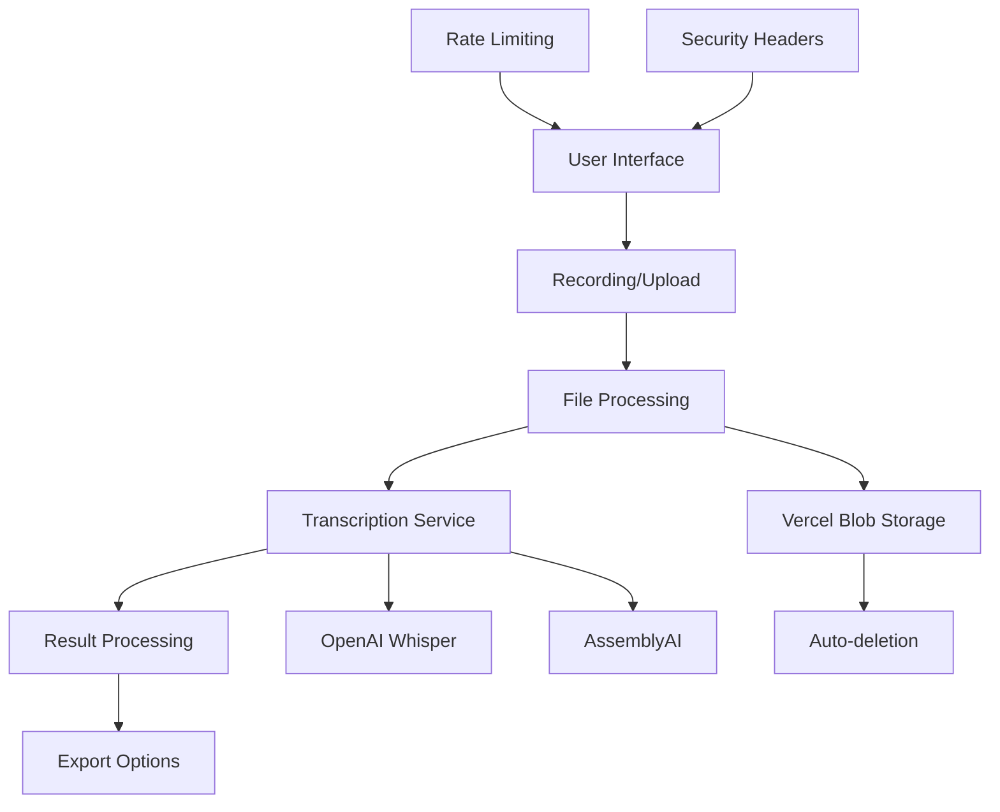

# Audio Transcriptor

Professional audio transcription web application with recording, upload, and multi-format export capabilities. Built for **100% Vercel deployment** with no local development requirements.

[](https://vercel.com/new/clone?repository-url=https://github.com/your-username/audio-transcriptor)

## 🎯 Features

### Core Functionality
- **🎙️ In-browser recording** with pause/resume and waveform visualization
- **📤 Drag & drop upload** with chunked/resumable uploads for large files
- **🔄 Multi-file queue** with progress tracking and job management
- **✏️ Interactive transcript editor** with segment editing and timestamp navigation
- **📥 Multi-format export** (TXT, SRT, VTT, JSON) with customization options

### Transcription Backends
- **OpenAI Whisper** - High-quality transcription with translation support
- **AssemblyAI** - Advanced AI with speaker diarization and analysis
- **Pluggable architecture** for easy backend additions

### Advanced Features
- **🎭 Speaker diarization** (AssemblyAI only)
- **🌍 Language auto-detection** with manual override
- **🔄 Translation to English** (Whisper only)
- **⏱️ Word-level timestamps** for precise editing
- **📊 Confidence scoring** and quality metrics
- **🌙 Dark theme** with accessibility features

### Security & Privacy
- **🔒 No persistent storage** - files auto-deleted after processing
- **🚀 Rate limiting** and file validation
- **🛡️ CSRF/CORS protection** with security headers
- **📝 No analytics** by default (configurable)

## 🏗️ Architecture



### Tech Stack
- **Framework**: Next.js 14 with TypeScript
- **Styling**: Tailwind CSS with dark theme
- **State Management**: Zustand with persistence
- **File Storage**: Vercel Blob (temporary)
- **API**: Next.js API routes (serverless)
- **Deployment**: Vercel (100% serverless)

## 🚀 Deployment to Vercel

### Prerequisites
- GitHub account
- Vercel account
- OpenAI API key (required)
- AssemblyAI API key (optional, recommended)

### One-Click Deploy

1. **Click the Deploy Button**
   [](https://vercel.com/new/clone?repository-url=https://github.com/your-username/audio-transcriptor)

2. **Configure Environment Variables**
   ```bash
   # Required
   OPENAI_API_KEY=sk-your-openai-api-key-here
   BLOB_READ_WRITE_TOKEN=your-vercel-blob-token-here
   
   # Optional (recommended)
   ASSEMBLYAI_API_KEY=your-assemblyai-api-key-here
   
   # Optional settings
   MAX_FILE_SIZE_MB=100
   MAX_FILES_PER_HOUR=10
   MAX_DURATION_MINUTES=30
   ENABLE_DIARIZATION=true
   ENABLE_TRANSLATION=true
   ```

3. **Deploy**
   - Click "Deploy"
   - Wait for build completion (~2 minutes)
   - Access your app at `https://your-app.vercel.app`

### Manual Deployment Steps

1. **Fork/Clone Repository**
   ```bash
   git clone https://github.com/your-username/audio-transcriptor.git
   ```

2. **Push to Your GitHub**
   ```bash
   cd audio-transcriptor
   git remote set-url origin https://github.com/YOUR-USERNAME/audio-transcriptor.git
   git push -u origin main
   ```

3. **Import to Vercel**
   - Go to [vercel.com](https://vercel.com)
   - Click "New Project"
   - Import from GitHub
   - Select your forked repository

4. **Add Environment Variables**
   - In Vercel dashboard: Project Settings → Environment Variables
   - Add all required variables from `.env.example`

5. **Deploy**
   - Vercel will automatically build and deploy
   - No additional configuration needed

## 🔧 Environment Variables Reference

### Required Variables
```bash
# OpenAI API for Whisper transcription
OPENAI_API_KEY=sk-your-openai-key-here

# Vercel Blob for temporary file storage
BLOB_READ_WRITE_TOKEN=vercel_blob_rw_your-token-here
```

### Optional Variables
```bash
# AssemblyAI API for advanced features
ASSEMBLYAI_API_KEY=your-assemblyai-key-here

# File size limits (in MB)
MAX_FILE_SIZE_MB=100
MAX_DURATION_MINUTES=30

# Rate limiting
MAX_FILES_PER_HOUR=10

# Feature flags
ENABLE_DIARIZATION=true
ENABLE_TRANSLATION=true
ENABLE_WHISPER_BACKEND=true
ENABLE_ASSEMBLYAI_BACKEND=true

# Audio processing
CHUNK_SIZE_MB=10
DEFAULT_LANGUAGE=auto
```

### Getting API Keys

**OpenAI API Key** (Required)
1. Visit [platform.openai.com](https://platform.openai.com)
2. Sign up/login and go to API Keys
3. Create new secret key
4. Add billing information (Whisper API is pay-per-use)

**AssemblyAI API Key** (Optional)
1. Visit [assemblyai.com](https://www.assemblyai.com)
2. Sign up for free account
3. Get API key from dashboard
4. Free tier includes 5 hours/month

**Vercel Blob Token** (Required)
1. In Vercel dashboard: Storage → Blob
2. Create new Blob store
3. Copy the read/write token
4. Add to environment variables

## ✅ Verification & Testing

### Vercel Preview URLs
After deployment, test using Vercel preview URLs:

1. **Health Check**
   ```
   GET https://your-app.vercel.app/api/health
   ```

2. **Available Backends**
   ```
   GET https://your-app.vercel.app/api/transcribe
   ```

### CI Pipeline
The GitHub Actions workflow runs:
- **Linting** with ESLint
- **Type checking** with TypeScript
- **Unit tests** with Jest
- **Build verification**

All checks must pass for successful deployment.

### Testing Checklist
- [ ] App loads without errors
- [ ] Recording interface works (requires microphone permission)
- [ ] File upload accepts audio files
- [ ] Transcription completes successfully
- [ ] Export generates files correctly
- [ ] Settings save and persist
- [ ] Mobile interface is responsive
- [ ] Health endpoint returns backend info

## 📱 Browser Compatibility

### Supported Browsers
- **Chrome 90+** (recommended)
- **Firefox 88+**
- **Safari 14+**
- **Edge 90+**

### Required Browser Features
- Web Audio API (for recording)
- MediaRecorder API (for audio capture)
- File API (for uploads)
- IndexedDB (for offline storage)

### Mobile Support
- **iOS Safari 14+**
- **Chrome Mobile 90+**
- **Samsung Internet 14+**

## 🔒 Privacy & Security

### Data Handling
- **No persistent storage** - audio files deleted after processing
- **Temporary storage** in Vercel Blob with 24-hour TTL
- **No user accounts** - all data client-side only
- **No tracking** by default

### Security Features
- **File validation** with type and size checks
- **Rate limiting** per IP address
- **CORS protection** with strict origins
- **CSP headers** for XSS protection
- **Secure upload** with sanitized filenames

### Third-Party Data Processing
- **OpenAI**: Audio sent to Whisper API, not stored by OpenAI
- **AssemblyAI**: Audio processed on AssemblyAI servers, deleted after processing
- **Vercel**: Temporary file storage, auto-deleted

## 🎯 Transcription Backend Capabilities

| Feature | OpenAI Whisper | AssemblyAI |
|---------|----------------|-------------|
| **Max File Size** | 25MB | 100MB |
| **Max Duration** | 30 minutes | 4 hours |
| **Languages** | 99+ languages | 30+ languages |
| **Word Timestamps** | ✅ | ✅ |
| **Speaker Diarization** | ❌ | ✅ |
| **Translation** | ✅ (to English) | ❌ |
| **Confidence Scores** | Basic | Detailed |
| **Processing Speed** | Fast | Medium |
| **Cost** | $0.006/minute | $0.00065/second |

### Choosing a Backend
- **OpenAI Whisper**: Best for multilingual content, translation needs
- **AssemblyAI**: Best for speaker separation, detailed analysis

## 🚨 Troubleshooting

### Common Vercel Deployment Issues

**Build Failures**
```bash
# Check build logs in Vercel dashboard
# Common causes:
- Missing environment variables
- TypeScript errors
- Dependency conflicts
```

**API Timeouts**
- Vercel serverless functions have 10-second timeout
- Large files may need chunked processing
- Check function logs in Vercel dashboard

**Storage Issues**
- Verify Blob token has read/write permissions
- Check Blob storage quota in Vercel dashboard
- Files auto-delete after 24 hours

**Rate Limiting**
- Default: 10 transcriptions per hour per IP
- Adjust `MAX_FILES_PER_HOUR` if needed
- Monitor usage in API logs

### Performance Optimization

**Large Files**
- Enable chunked uploads for files >10MB
- Consider file compression before upload
- Use AssemblyAI for files >25MB (Whisper limit)

**Cold Starts**
- First request may be slower (~2-3 seconds)
- Subsequent requests are faster
- Consider keeping functions warm with cron jobs

**Memory Usage**
- Vercel functions have 1GB memory limit
- Large files may hit memory constraints
- Use streaming where possible

### API Error Codes

| Code | Issue | Solution |
|------|--------|----------|
| `400` | Invalid file format | Check supported formats |
| `413` | File too large | Reduce file size or change limits |
| `429` | Rate limit exceeded | Wait or increase limits |
| `503` | Backend unavailable | Check API keys and quotas |

## 📈 Roadmap

### Planned Features
- **Batch export** of multiple transcriptions
- **Custom vocabularies** for improved accuracy
- **Subtitle burn-in** for video files
- **Webhook integrations** for external services
- **SSO integration** for team usage
- **Usage quotas** and billing integration
- **Multi-track audio** support
- **Real-time transcription** for live audio

### API Extensions
- **Webhook callbacks** for long-running jobs
- **Transcript search** and indexing
- **Custom export templates**
- **Audio preprocessing** (noise reduction, normalization)

## 🤝 Contributing

### Development Setup
```bash
git clone https://github.com/your-username/audio-transcriptor.git
cd audio-transcriptor
npm install
cp .env.example .env.local
# Add your API keys to .env.local
npm run dev
```

### Running Tests
```bash
npm test           # Run once
npm run test:watch # Watch mode
npm run test:ci    # CI mode with coverage
```

### Code Style
- **ESLint** for JavaScript/TypeScript
- **Prettier** for formatting (via ESLint)
- **TypeScript strict** mode
- **Conventional commits** for changelog generation

## 📄 License

MIT License - see [LICENSE](LICENSE) for details.

## 🆘 Support

- **GitHub Issues**: [Create an issue](https://github.com/your-username/audio-transcriptor/issues)
- **Discussions**: [GitHub Discussions](https://github.com/your-username/audio-transcriptor/discussions)
- **Email**: support@audio-transcriptor.com

---

**Built with ❤️ for the community**

Deploy now: [](https://vercel.com/new/clone?repository-url=https://github.com/your-username/audio-transcriptor)